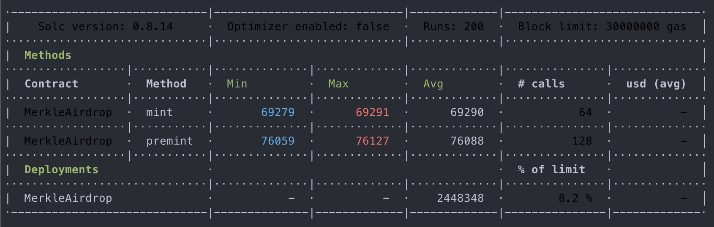
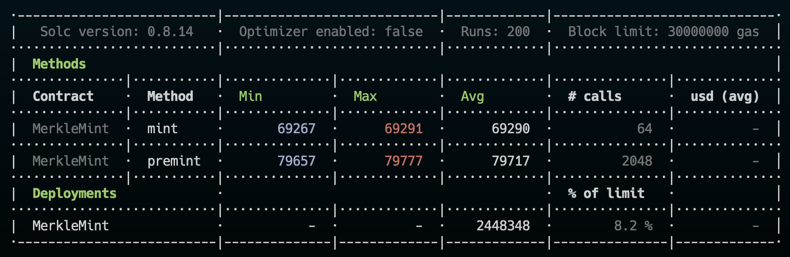
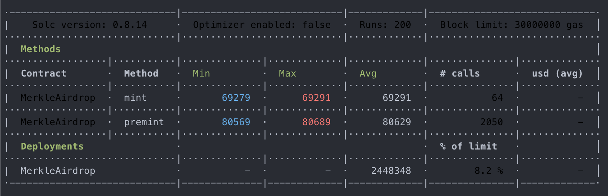

# Merkle experimentation for airdrop

## Introduction

This repository is an experimentation that shows how Merkle Trees work, and how they can be used for pre-sale mint and airdrop process'. The code in this repository is not production-ready. Please, take into consideration concerns and comments in the [note](#notes) section before using it in production.

[](https://www.youtube.com/watch?v=YIc6MNfv5iQ)
<p align="center">
    Watch this introduction to understand how Merkle Trees enable the decentralized web
</p>

## Installation

All you need to do is install the dependencies needed

```shell
npm i
```

## Test

You can run the tests by running this command

```shell
npm run test
```

You can generate a gas report by running this dedicated command

```shell
npm run test:gas
```

If you want, you can customize how many addresses would be in the whitelist generated for each test by updating the environment variable called `NUMBER_OF_ADRESSES_TO_GENERATE`. 

**Note**: The tests will ensure the value passed will generate a balanced Merkle tree. If it's not the case, the default value (32) would be used.

## Utils

You can generate a random Merkle tree by running this command. 

```shell
npm run merkle
```

Want to print the Merkle created by the command above? You can use this command

```shell
npm run merkle:print
```

**Note**: The environment variable `NUMBER_OF_ADRESSES_TO_GENERATE` works for the command listed above.

## Gas snapshots

Below, are snapshots taken during a gas consumption benchmark. The `mint` method is just a wrapper of the internal `_mint` method of the ERC721 OpenZeppelin contract. The `premint` method does the Merkle Tree logic stuff before calling the internal `_mint` method of the ERC721 OpenZeppelin contract. The difference is what it cost to run Merkle Tree verification for X addresses.

**Note**: Function selectors aren't the same. The simple fact of calling a function with a different selector makes its call more expensive, however, the difference in price in this benchmark is negligible.


**This benchmark was made with a Merkle tree that contains 64 addresses**



**This benchmark was made with a Merkle tree that contains 256 addresses**


**This benchmark was made with a Merkle tree that contains 1,024 addresses**



**This benchmark was made with a Merkle tree that contains 2,048 addresses**




## Notes

A Merkle Tree with n leaves has O(log2 n) sized proofs. That explains the result of the benchmarks above and why we can strictly check the number of proofs on-chain.

This implementation checks three depths, meaning that an attacker can’t just supply intermediate values directly. That means this implementation is protected against the [second pre-image attack](https://en.wikipedia.org/wiki/Merkle_tree#Second_preimage_attack) attack. If you want to protect against this attack without checking the three depths, one of the solutions is to differentiate between leaf nodes and intermediate nodes in the tree by prepending a different byte value for leaf and intermediate nodes (such as 0x00 and 0x01 as in the certificate transparency implementation).  More info about the attack [here](https://flawed.net.nz/2018/02/21/attacking-merkle-trees-with-a-second-preimage-attack/)

This implementation makes sure to always build balance trees by adding as many leaves as needed to balanced the tree. As this implementation is intended to work in the EVM ecosystem, `address(0)` was chosen to fill empty leaf slots. That's why this implementation isn't vulnerable to a forgery attack for an unbalanced tree, where the last leaf node can be duplicated to create an artificial balanced tree, resulting in the same Merkle root hash. One example of this attack [here](https://bitcointalk.org/?topic=102395).

## Ressources

[A Digital Signature Based on a Conventional Encryption Function](https://people.eecs.berkeley.edu/~raluca/cs261-f15/readings/merkle.pdf2)

[Preimage Attacks on Round-reduced Keccak -224/256 via an Allocating Approach](https://eprint.iacr.org/2019/248.pdf)

[What is a preimage attack](https://www.comparitech.com/blog/information-security/what-is-preimage-attack/#Cryptographic_hash_function_basics)

[Wikipedia: Merkle Tree](https://en.wikipedia.org/wiki/Merkle_tree)

[Brilliant.org: Merkle Tree](https://brilliant.org/wiki/merkle-tree/)

[Medium: Techskill Brew](https://medium.com/techskill-brew/merkle-tree-in-blockchain-part-5-blockchain-basics-4e25b61179a2)
