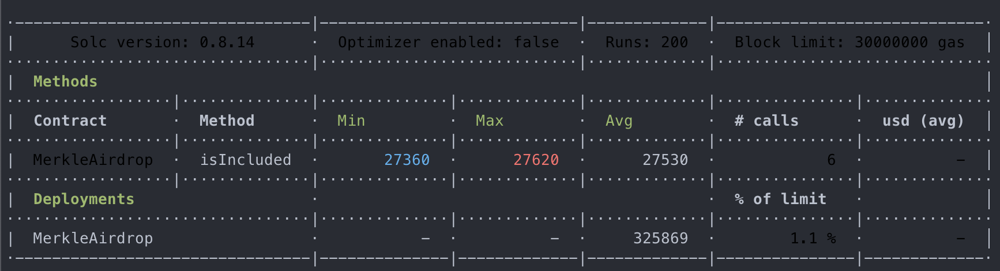
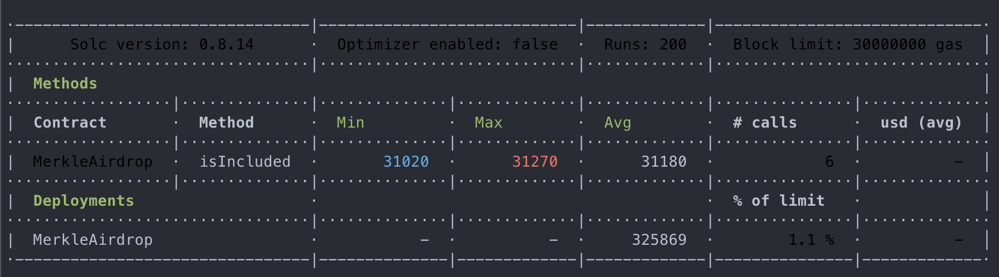

# Merkle experimentation for airdrop

## Installation

First, install all the dependencies needed

```shell
npm i
```

Then, generate a fake whitelist by running this command

```shell
npm run whitelist:generate
```

By default, the whitelist will contain 2046 addresses. If you want to customize the number of addresses that should be generated, create a `.env` file at the root of the project and set the desired value to the variable called `NUMBER_OF_ADRESSES_TO_GENERATE`

## Test

You can run the tests by running this command

```shell
npm run test
```

You can generate a gas report by running this dedicated command

```shell
npm run test:gas
```

## Gas snapshots

Below, are snapshots taken during a gas consumption benchmark.

**This benchmark was made with a Merkle tree that contains 10 addresses**



**This benchmark was made with a Merkle tree that contains 200 addresses**



**This benchmark was made with a Merkle tree that contains 2,046 addresses**


**This benchmark was made with a Merkle tree that contains 10,000 addresses**


## Notes

A Merkle Tree with n leaves has O(log2 n) sized proofs. That explains the result of the benchmarks above.

As is, this implementation is vulnerable to a [second pre-image attack](https://en.wikipedia.org/wiki/Merkle_tree#Second_preimage_attack). That's why we have to use a different hashing function for leaves and nodes in production. Thanks to that, H(x) != H'(x).

Also, as is, this implementation is vulnerable to a forgery attack for an unbalanced tree, where the last leaf node can be duplicated to create an artificial balanced tree, resulting in the same Merkle root hash. Do not accept unbalanced tree to prevent this.

More info [here](https://bitcointalk.org/?topic=102395).

## Ressources

[Wikipedia: Merkle Tree](https://en.wikipedia.org/wiki/Merkle_tree)

[Brilliant.org: Merkle Tree](https://brilliant.org/wiki/merkle-tree/)

[Medium: Techskill Brew](https://medium.com/techskill-brew/merkle-tree-in-blockchain-part-5-blockchain-basics-4e25b61179a2)

[Youtube: How Merkle Trees Enable the Decentralized Web!](https://www.youtube.com/watch?v=YIc6MNfv5iQ)

